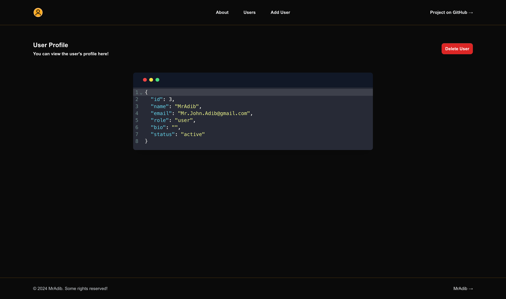

# Simple User Management

A lightweight and efficient user management system built with **Next.js**, **tRPC**, and **TypeScript**. This app allows you to add, view, and delete users with ease. It features pagination, validation, and is fully responsive.

<https://www.loom.com/share/0e6d62dc88974c3889997e740f8315b6?sid=a92187c6-3ef9-4888-b63d-96ff83fce100>

## Features

- CRUD Operations: Create, Read, and Delete users.
- Pagination: Efficiently handle large sets of users with built-in pagination.
- Validation: Ensure that all inputs are properly validated.
- tRPC Integration: API routing and types are inferred using tRPC.
- Responsive Design: Works seamlessly across desktop and mobile devices.
- TypeScript Support: Fully typed, making it easier to work with data and spot errors.
- Dark Mode: Optional dark mode for better readability at night!

## Tech Stack & Technologies

- **[Next.js](https://nextjs.org/)**: React framework for server-side rendering and static site generation.
- **[React](https://reactjs.org/)**: A JavaScript library for building user interfaces.
- **[tRPC](https://trpc.io/)**: End-to-end type-safe APIs for faster development.
- **[PostgreSQL](https://www.postgresql.org/)**: Open-source relational database system.
- **[Drizzle ORM](https://orm.drizzle.team)**: A lightweight ORM for Node.js and TypeScript to ship ship ship!
- **[Docker](https://www.docker.com/)**: Containerization platform for building, shipping, and running applications.
- **[Docker Compose](https://docs.docker.com/compose/)**: Tool for defining and running multi-container Docker applications.
- **[TypeScript](https://www.typescriptlang.org/)**: Typed superset of JavaScript that compiles to plain JavaScript.
- **[Tailwind CSS](https://tailwindcss.com/)**: A utility-first CSS framework for rapid UI development.
- **[Zod](https://zod.dev)**: TypeScript-first schema declaration and validation library.
- **[Vitest](https://vitest.dev/)**: A blazing fast unit-test framework powered by Vite.
- **[ESLint](https://eslint.org/)**: Pluggable and configurable linter tool for identifying and reporting on patterns in JavaScript.
- **[Prettier](https://prettier.io/)**: Opinionated code formatter that ensures consistency across your codebase.
- **[GitHub Actions](https://github.com/features/actions)**: CI/CD tool that helps automate software workflows.
- **[Loom](https://www.loom.com/)**: Video messaging tool for recording and sharing quick videos.

## Installation

1. Clone the repository:

   ```bash
   git clone https://github.com/JohnAdib/trpc-user-crud.git
   ```

2. **Copy the necessary environment files:**

   - Make sure to copy the `.env.example` file in the root directory and rename it to `.env`. Update the environment variables as needed.

   ```bash
   cp .env.example .env
   ```

3. Build and start the docker containers:

   ```bash
   docker-compose up --build
   ```

4. Access the app at `http://localhost:3020`.

## Testing

Tests are run automatically in the pipeline using **GitHub Actions** for continuous integration. If you'd like to run them locally, follow these steps:

1. Install dependencies:

   ```bash
   npm install
   ```

2. Run the tests:

   ```bash
   npm run test
   ```

This project uses **Vitest** for unit testing. Due to time constraints and my learning curve with tRPC, I didn't have as much time to write comprehensive tests as needed. However, there are some minimal unit tests for utility functions and validation logic using Vitest.

If more time were available, adding integration tests and E2E tests with Cypress would be a great improvement for ensuring the system works end-to-end.

## Screenshots



